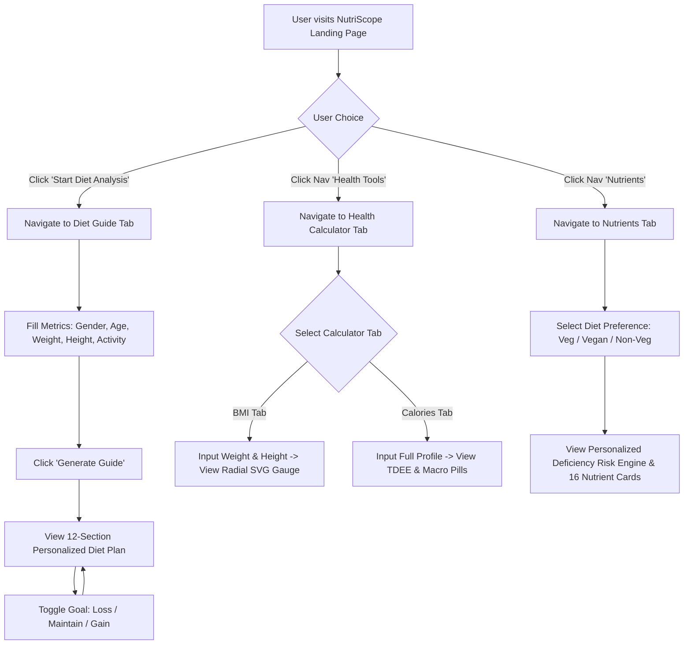

# 🥗 NutriScope — Complete Site Interface & Architecture Manifest

> **Agent Reference Document**: This document provides an exhaustive overview of NutriScope's frontend architecture, component hierarchy, user interface states, health calculation algorithms, data structures, and design system. Designed specifically for AI agents, developers, and system integrators.

---

## 📋 Table of Contents
1. [Project Summary & Tech Stack](#1-project-summary--tech-stack)
2. [Application Architecture & Routing](#2-application-architecture--routing)
3. [Design System & Visual Aesthetic](#3-design-system--visual-aesthetic)
4. [Component Directory & Interactive Features](#4-component-directory--interactive-features)
5. [Health Calculations & Algorithms](#5-health-calculations--algorithms)
6. [Data Schemas & Databases](#6-data-schemas--databases)
7. [User Flows & Key Interactions](#7-user-flows--key-interactions)
8. [Agent Quick Reference (Prompt Context)](#8-agent-quick-reference-prompt-context)

---

## 1. Project Summary & Tech Stack

**NutriScope** is a high-fidelity, interactive web application providing personalized nutrition insights, diet planning, body metric tracking (BMI & TDEE), macro breakdowns, and evidence-based nutrient education tailored particularly for Indian dietary profiles.

### Core Technology Stack
- **Framework**: React 19 (`react`, `react-dom`)
- **Build Tool / Bundler**: Vite 8 (`vite`, `@vitejs/plugin-react`)
- **Animation Engines**: 
  - Framer Motion 12 (`framer-motion`) for page transitions, component mounting/unmounting (`AnimatePresence`), floating tilt dynamics, and spring physics.
  - GSAP 3 (`gsap`) for high-performance visual animations.
- **Styling**: Tailwind CSS 4 (`tailwindcss`, `@tailwindcss/vite`) combined with extensive custom CSS design tokens in `src/index.css`.
- **Linter**: Oxlint (`oxlint`).

---

## 2. Application Architecture & Routing

NutriScope operates as a state-driven Single Page Application (SPA). Instead of traditional path-based routing (e.g. `react-router-dom`), navigation is powered by a central tab state controlled inside `App.jsx`.

### Routing State (`activeTab`)
- **Location**: `App.jsx` (`const [activeTab, setActiveTab] = useState('home')`)
- **Transitions**: Wrapped in `<AnimatePresence mode="wait">` with smooth slide-fade variants:
  - `initial`: `{ opacity: 0, y: 30 }`
  - `animate`: `{ opacity: 1, y: 0, transition: { duration: 0.5, ease: [0.16, 1, 0.3, 1] } }`
  - `exit`: `{ opacity: 0, y: -20, transition: { duration: 0.3 } }`

### Tab Registry

| Tab Key | Display Label | Emoji | Associated Component | Description |
| :--- | :--- | :--- | :--- | :--- |
| `home` | Home | 🏠 | `HeroSection` + `CTASection` | Landing page featuring 3D bowl, value prop, and direct CTA |
| `features` | Features | ✨ | `FeaturesSection` | Overview of core platform capabilities & benefits |
| `how-it-works` | How It Works | ⚙️ | `HowItWorks` | 3-step interactive breakdown of NutriScope analysis |
| `health-tools` | Health Tools | ⚡ | `HealthCalculator` | BMI Gauge Calculator & Mifflin-St Jeor TDEE Macro Tool |
| `diet-guide` | Diet Guide | 🥑 | `DietGuidePage` | Full form for user metrics generating 12-section Personalized Diet Plan |
| `nutrients` | Nutrients | 🧬 | `EssentialNutrients` | Interactive database of 16 vitamins/minerals & deficiency risk engine |

---

## 3. Design System & Visual Aesthetic

NutriScope uses a **Modern Dark Glassmorphism Design System** crafted to impress at first glance.

### Visual Foundations
- **Color Scheme**: Deep dark background (`#0B0F17` / `#0A0D14`), subtle glass card backgrounds (`rgba(255, 255, 255, 0.03)` with `backdrop-filter: blur(16px)`), luminous border strokes (`rgba(255, 255, 255, 0.08)`).
- **Accent Gradients**:
  - Primary Green/Emerald Gradient: `linear-gradient(135deg, #10B981 0%, #059669 100%)`
  - Text Highlights: Multi-stop vibrant gradients (`#34D399` to `#3B82F6`)
  - Accent Colors for BMI/Nutrient Risk: Green (`#22C55E`), Blue (`#38BDF8`), Yellow (`#FACC15`), Orange (`#F97316`), Red (`#EF4444`).
- **Typography**: Clean sans-serif system stack, smooth font smoothing (`antialiased`), clear hierarchy with cursive/italic serif accents for section hero titles.
- **Interactive Micro-Animations**:
  - Hover elevation with scale and subtle border glow.
  - Ripple effect on primary buttons upon click.
  - Mouse-position-driven 3D parallax tilt for visual elements.
  - SVG radial arc rendering for gauges.

---

## 4. Component Directory & Interactive Features

### 1. `App.jsx`
- **Role**: Top-level layout container and router.
- **Child Components**: `AnimatedBackground`, `Navbar`, `Footer`, and dynamic tab views (`HeroSection`, `FeaturesSection`, `HowItWorks`, `HealthCalculator`, `DietGuidePage`, `EssentialNutrients`).

### 2. `Navbar.jsx`
- **Role**: Fixed floating navigation header.
- **Features**:
  - Logo (`🥗 NutriScope`) triggers reset to `home` tab.
  - Scroll detector: Adds `.scrolled` state when `window.scrollY > 50` for condensed backdrop.
  - Desktop nav links with active indicator pill.
  - Mobile hamburger menu toggle with full-screen or slide-down navigation links.

### 3. `HeroSection.jsx`
- **Role**: Main landing hero section.
- **Key Features**:
  - **3D Parallax Food Bowl**: Mouse movement tracking (`useMotionValue`, `useSpring`) shifts and tilts the food bowl image (`/food-bowl.png`) dynamically (`rotateX`, `rotateY`, `translateX`, `translateY`).
  - **Steam Particle System**: Canvas-free CSS/JS animated rising steam particles emerging from food bowl.
  - **Floating Food Badges**: 10 floating interactive badges (Vitamin C, High Fiber, Hydration, etc.) with floating hover tooltips.
  - **Primary CTA**: Button "Start Diet Analysis" triggers callback to switch `activeTab` directly to `'diet-guide'`.

### 4. `DietGuidePage.jsx`
- **Role**: Dedicated personalized diet generation page.
- **State Management**:
  - `gender` ('male' | 'female')
  - `age` (string / number)
  - `weight` (kg)
  - `heightCm` (cm)
  - `activityLevel` (index 0 to 4)
  - `calculated` (boolean)
- **Behavior**:
  - Form validation (`isValid = weight && heightCm && age`).
  - Generates calculated BMI and maintenance calories using formulas.
  - On submit, renders the `PersonalizedDietGuide` component with calculated metrics.
  - Edit mode: "Edit my profile" resets state to adjust metrics.

### 5. `PersonalizedDietGuide.jsx`
- **Role**: Renders an extensive 12-section custom nutrition blueprint based on user metrics.
- **Goal Switcher**: Interactive tabs for `Weight Loss`, `Maintain`, and `Muscle Gain` recalculates macro split in real-time.
- **Displayed Sections**:
  1. **Nutrition Summary Grid**: Daily Calories, BMI Category, Protein Goal (g), Carbs Goal (g), Fat Goal (g), Daily Water (L), Fiber (g), Meal Frequency.
  2. **Personalized Daily Targets**: Detailed breakdown including fruit, vegetable, and dairy serving suggestions.
  3. **BMI Health Insight**: Conditional health risk assessment banner based on BMI.
  4. **Foods You Should Eat More**: Categorized by Protein (Vegetarian & Non-Veg), Healthy Carbs, Healthy Fats, Vegetables & Fruits.
  5. **BMI-Tailored Foods**: Specific dietary additions/reductions tuned to Underweight, Normal, Overweight, or Obese categories.
  6. **Foods To Limit**: Unhealthy drinks, ultra-processed snacks, high-sodium foods, deep-fried items.
  7. **Goal Blueprint**: Customized actionable bullet points for loss/maintenance/gain.
  8. **Meal Timing & Macro Split**: Breakdown by Breakfast (20-25%), Lunch (30-35%), Dinner (25-30%), Snacks (10-20%).
  9. **Indian Diet Suggestions**: Culturally contextual meal ideas for Indian households.
  10. **Healthy Core Habits**: 12 fundamental nutrition habits.
  11. **Lifestyle Tips**: Badges for sleep, walking, hydration, posture, stress.
  12. **Daily Micronutrient Checklist**: Filterable/readable micronutrients table.

### 6. `HealthCalculator.jsx`
- **Role**: Dual-tool calculator tab for instant health metrics.
- **Sub-Tools**:
  - **BMI Calculator Tab**:
    - Takes Weight (kg) and Height (cm).
    - Renders custom SVG **Radial Arc Gauge (`BmiGauge`)** with animated pointer offset, category color-coding, tick marks at 18.5, 25, and 30, and category advice text.
  - **Calorie / TDEE Calculator Tab**:
    - Takes Gender, Age, Weight, Height, Activity Level.
    - Calculates BMR & TDEE.
    - Renders **Macro Pills** (Protein, Carbs, Fats) with color dots and calorie values.
    - Renders **Calorie Goals Cards**: Weight Loss (-20%), Maintenance (100%), Muscle Gain (+15%).

### 7. `EssentialNutrients.jsx`
- **Role**: Educational hub for vitamins, minerals, and dietary deficiency prevention.
- **Interactive Diet Selector**: Filter by `Vegetarian`, `Vegan`, `Eggetarian`, `Non-Vegetarian`.
- **Smart Recommendation Engine**: Dynamically categorizes risk levels:
  - Higher Risk For You
  - Likely Adequate
  - Food First Strategy
  - Consider Testing
- **Infographic**: Indian population deficiency stats (Vitamin D, B12, Iron, Calcium, Protein, Zinc).
- **Nutrient Cards**: 16 expandable grid cards displaying Importance, Risk Badge, Sources, RDA, Benefits, Deficiency Symptoms, Supplement Guidance, and Special Notes.

### 8. `FeaturesSection.jsx`
- Grid of core platform benefits: AI Diet Analysis, Micronutrient Tracking, BMI & Macro Engine, Personalized Recommendations.

### 9. `HowItWorks.jsx`
- 3-step timeline: 1. Input Metrics → 2. AI Processing & Analysis → 3. Receive Tailored Plan.

### 10. `CTASection.jsx`, `Footer.jsx`, `AnimatedBackground.jsx`
- `CTASection`: Bottom page banner encouraging analysis initiation.
- `Footer`: Branding, links, disclaimer, copyright notice.
- `AnimatedBackground`: Dynamic background ambient particle and gradient orb animations.

---

## 5. Health Calculations & Algorithms

### 1. Body Mass Index (BMI)
$$\text{BMI} = \frac{\text{Weight (kg)}}{\left(\frac{\text{Height (cm)}}{100}\right)^2}$$

#### BMI Categories & Gauge Mapping:
- **Underweight**: $\text{BMI} < 18.5$ (Color: `#38BDF8`)
- **Normal**: $18.5 \le \text{BMI} < 25.0$ (Color: `#22C55E`)
- **Overweight**: $25.0 \le \text{BMI} < 30.0$ (Color: `#FACC15`)
- **Obese**: $\text{BMI} \ge 30.0$ (Color: `#F97316`)

### 2. Basal Metabolic Rate (BMR) — Mifflin-St Jeor Formula
- **Male**: $\text{BMR} = 10 \times \text{weight(kg)} + 6.25 \times \text{height(cm)} - 5 \times \text{age(yr)} + 5$
- **Female**: $\text{BMR} = 10 \times \text{weight(kg)} + 6.25 \times \text{height(cm)} - 5 \times \text{age(yr)} - 161$

### 3. Total Daily Energy Expenditure (TDEE)
$$\text{TDEE} = \text{BMR} \times \text{Activity Factor}$$

| Activity Level | Factor | Description |
| :--- | :--- | :--- |
| **Sedentary** | `1.20` | Little or no exercise |
| **Light** | `1.375` | Exercise 1–3 days/week |
| **Moderate** | `1.55` | Exercise 3–5 days/week |
| **Active** | `1.725` | Exercise 6–7 days/week |
| **Very Active**| `1.90` | Intense daily training |

### 4. Goal-Based Calorie Targets
- **Weight Loss**: $\text{TDEE} \times 0.80$ (-20% deficit)
- **Maintenance**: $\text{TDEE} \times 1.00$
- **Muscle Gain**: $\text{TDEE} \times 1.15$ (+15% surplus)

### 5. Macro Distribution Rules
- **Protein**: 
  - Maintenance: $1.6 \times \text{weight(kg)}$ grams
  - Weight Loss: $1.8 \times \text{weight(kg)}$ grams
  - Muscle Gain: $2.0 \times \text{weight(kg)}$ grams
  - Calories: $\text{Protein (g)} \times 4\text{ kcal}$
- **Fat**:
  - Target: $0.8 \times \text{weight(kg)}$ grams
  - Calories: $\text{Fat (g)} \times 9\text{ kcal}$
- **Carbohydrates**:
  - Remaining Calories: $\text{Target Calories} - (\text{Protein Kcal} + \text{Fat Kcal})$
  - Grams: $\frac{\text{Remaining Calories}}{4\text{ kcal/g}}$

### 6. Hydration & Fiber Rules
- **Water Target**: $\frac{35 \times \text{weight(kg)}}{1000}$ to $\frac{40 \times \text{weight(kg)}}{1000}$ Liters/day.
- **Fiber Target**: $38\text{ g/day}$ (Male), $25\text{ g/day}$ (Female).

---

## 6. Data Schemas & Databases

### Essential Nutrients Database (`EssentialNutrients.jsx`)
Array of 16 structured objects representing essential dietary elements:

```json
{
  "id": "vitD",
  "name": "Vitamin D",
  "deficiencyRisk": "Very High",
  "importance": "Bone strength, Immunity, Mood, Hormones",
  "benefits": "Crucial for bone strength, immunity, mood, and hormones.",
  "symptoms": "Bone pain, weakness, fatigue, frequent illness.",
  "foodSources": "Sunlight, Egg yolk, Fish, Fortified milk",
  "rda": "400-800 IU",
  "supplement": "Often required after blood testing.",
  "details": "Despite abundant sunlight in India, deficiency is widespread due to indoor lifestyles, clothing, pollution, and sunscreen use."
}
```

*Tracked Nutrients*: Protein, Vitamin D, Vitamin B12, Iron, Calcium, Magnesium, Zinc, Omega-3, Vitamin C, Folate (B9), Vitamin A, Vitamin E, Vitamin K, Potassium, Selenium, Iodine.

---

## 7. User Flows & Key Interactions



---

## 8. Agent Quick Reference (Prompt Context)

If you are an AI agent generating code, modifying features, or integrating APIs for NutriScope:

1. **State Routing**: `activeTab` in `App.jsx` handles page switching. Always use `onTabChange('tab-id')` to navigate to another page.
2. **Form Sync**: When updating user metrics in `DietGuidePage` or `HealthCalculator`, resetting `calculated` state to `false` automatically clears past outputs so the user can recalculate.
3. **Responsive Breakpoints**: Ensure all grid structures (`summary-grid`, `foods-to-add-grid`, `indian-diet-grid`, `en-nutrient-grid`) collapse gracefully on mobile devices ($<768\text{px}$).
4. **Cultural Context**: Maintain the Indian dietary context (paneer, dal, poha, chana, ragi, dahi, etc.) alongside global options.
5. **Medical Disclaimer**: Always retain the disclaimer stating that calculations are for educational purposes and do not substitute medical advice.

---
*End of Manifest — Generated for NutriScope AI Agent Integration.*
